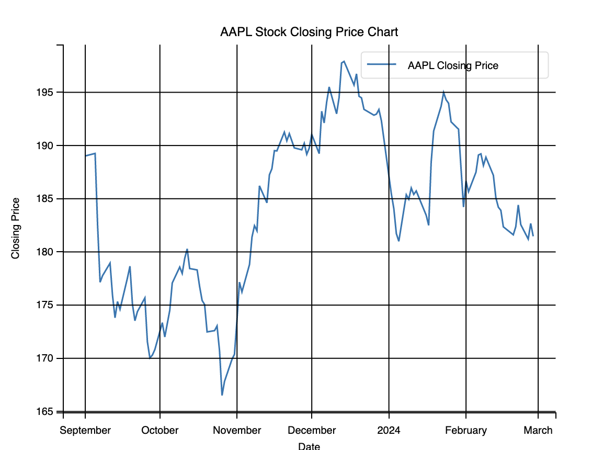

# Project 3: Algorithmic Trading Strategies

This is a TEAM 6 group project.

## Overview

For project #3. the focus is on Q-learning for stock trading.

The core idea behind Q-learning is:

* its RL (reinforcement learning) algorithm.

In the Q-learning RL algorithm. an agent

* learns the best actions to take in a given environment
* in order  to maximize rewards (the agent's goals).

Central to the agent are

* Q-Values which are maintained in table.

These "Q-values" are maintained by the agent and represent the expected future rewards when the agent takes

* a specific action
* in a particular state

The Q-values rewards are updated as the agent interact with the environment.
This interaction can take the form of

* learning and
* exploration.

### Application of Q-Learning to Stock Trading

To apply Q-Learning to Stock Trading the following approach is undertaken:

Maintain State:

* Current stock price
* Historical prices
* Technical indicators (e.g., moving averages)

Actions (that the agent can take):

* Buy
* Hold
* Sell

Design of a reward system:

* profitable trades, positive reward
* losses, negative reward

While a production system would account for transaction costs when calculating the reward,
The current, initial implementation submitted system leaves the transaction costs as a future enhancement.

Training

* The agent
  * interacts with historical stock data
  * updates the Q-values based on
    * rewards received
    * learns an optimal policy

### Implementation Details

The implementation details include:

* Pre-processing of the historical data
  * Clean
  * Normalize
* Feature Engineering
  * select technical indicators
* Tuning
  * Hyperparameters: learning rates, discount factors, exploration
* Overfitting detection:
  * Possible strategies - regularization, early stopping

## Selection Critria

The project presented is an initial project, with one security: AAPL.
The historical data is daily data over a period of 3 years.
AAPL was selected because stock's liquidity makes it a good
candidate, with significant activity, for use as a single stock during the 3 year window.
Three years was a compromise beween too little data (1 year) and
potentially stale data (5 years).

## Data Acquisition

The program to download the data is in file
"download_data.py"
The file to train the model is saved in the local directory to
"AAPL_3Y_Historical_Data.csv"
A separate test data file is saved in
"AAPL_6M_Test_Data.csv"

The training data covers a period of 3 years, the test data covers a period of 6 months
and is seperate from the training data.
After the model has been trained it is tested againts data is has not previoulsy seen.
The 6 month test data period follows immediately after the the 3 years window
for the training data.

## Clean the data

After the data is acquired, and before it can be reliably used,
it undergoes verification and transformation. The verification is also known as data cleaning.
The data needs verification in regards to

* missing values,
* duplicates,
* splits and dividends,
* outliers,
  and other potential issues that could affect the quality of the data.
  yfinance provides adjusted close prices that account for splits and dividends, and,
  as such, that is one item we can remove from the cleaning check.

The data is cleaned in python script
"clean_data.py"
The output file is saved as :
"AAPL_3Y_Historical_Data_Cleaned.csv"
The test output file is saved as
"AAPL_6M_Test_Data_Cleaned.csv"

## Reformating the data

After the historical data is cleaned, it is prepared for
consumption by the RL model.
Reformatting of the data is performed in python script
"reformat_data.py"
The output file is saved in
"AAPL_3Y_Historical_Data_Reformatted.csv"
The test data is saved in
"AAPL_6M_Test_Data_Reformatted.csv"

The reformat script performs the following transformations:

* extract 'Close' price column for standardization:
  scales the data to have a mean of 0 and a standard deviation of 1.
* create a 'Target' column
  by shifting the standardized close prices up by one row,
  aligning each day's price with the next day's price as its target for prediction.
  (Note that this necessitates dropping the last row.)
* add Daily Price change
  which is the difference between the closing price of the current day and
  the closing price of the previous day.
  This gives the model information about the momentum of the stock.
* add Daily Return.
  This the percentage change in the closing price from the previous day and normalizes the price changes.
  This can be useful for analyzing volatility and momentum.
* Moving Average.
  This smooths out price data to better identify trendsl.
  Currently using 5 and 10 day moving averages.
* Volume Change.
  Track day-to-day trading volume.
  Used to provide level of activity associated with price movements.
* Volatility.
  Degree of variation in the price over a period.
  Using 10 days in a rolling standard deviation of daily returns.

After formatting:

* Features
  * 'Close',
  * 'Daily\_Change',
  * 'Daily\_Return',
  * 'MA\_5',
  * 'MA\_10',
  * 'Volume\_Change', and
  * 'Volatility'
    are standardized and are now on a similar scale.
    A requirement for machine learning models to ensure no single feature dominates due to scale.
* We have designed the model so that it will predict the
  * 'Target' column,representing the next day's standardized 'Close' price.
    In RL supervised learning tasks the model learns to predict future price movements based on current and past information contained in the features we have prepared.
* The
  * 'Date',
  * 'Dividends', and
  * 'Stock Splits'
    columns remain unchanged.
    They serve as categorical information for standardization.

## Feature Selection

Start with all the features implemented. Subsequently, after evaluating performance,
feature selection can be trimmed, as too many features could result in overfitting.
Reducing the number of features without sarificing the positive results will result
in faster run times and less CPU cost.
We will do this only if necessary and leave this type of experimentation for a follow on task.

## Setting RL Environment

We will begin by deploying a Q-learning model.
More complex models like Deep Q-Networks (DQN) or Proximal Policy Optimization (PPO) have been
developed to address some of the shortcomings of Q-learning.
Using Q-learning initially will allow for work with the simpler model while attempting
to understand the basics of the data sets and any problem being addressed.
Subsequently, as the project evolves, graduating to more complex models is recommended.

Set up the RL Environment with:

* A State Space
  The features we have chosen
* An Action Space
  What the agent can do: buy, sell, hold
* A reward function
  base on Profit/Loss
  As indocated previoulsy,  the initial model ignores transaction costs as well as
  does not include risk metrics

To run the model , start with file
'qlearn_trainloop_withtest.py'

## Python Code

### qlearn_trainloop_withtest.py

Main program, starting point for the application trains the RL model for stock trading on historical data.

* StockTradingEnv
  initializes the trading environment with historical data from a CSV file
  Simulates the stock market:
  * where actions (buy, sell, hold) taken by the RL agent affect reward or loss
* QLearningAgent
  Parameters that define learning behavior
  * state size
  * action size
* training process
  * run a set number of episodes
  * reset env for each episode
  * during each eposide agent
    * interacts with the environment
    * chooses actions based on current policy
* agent Q-table
  * stores value of action to take in any state
  * updated after each action
    * reinforce positive results
    * discourage negatibe results
* in the exploration rate, the agent
  * explores new actions or
  * exploits known good actions,
  * exploration rate decays over time
    * exploration shifts from exploration to exploitation.
* evaluate_the_stock_mode()
  * this function runs after the RL model is built
  * tests RL agent on the unseen test data
  * assess RL agent performance.
  * during testing purely exploration is set to 0, to maximize rewards based
    based solely on learned Q-values
* evaluate_buy_and_hold()
  * baseline strategy
  * hold a stock from the start to the end of the test period,
  * simple but significant comparison
  * used tp assess the RL model's effectiveness.

### qlearn_trade_bins.py

Defines

* a simulated stock trading environment for the RL model.
* RL agent interacts by buying, selling, or holding stocks
* action based on the observed state

Initialization

* load cleaned and reformatted historical stock data from CSV file
* set initial balance
* defines the number of bins for discretizing continuous features,
* sets the state size, hardcoded to 12000000
  This large number was required to handling the contex state space
* discretize_features is invoked to prepare the data for the RL model
  * discretized processes the continuous market features, makes
  * makes the data easier for the RL model to interpret.

reset_the_model()

* resets the environment to its initial state
* required when starting a new episodes
* done during both training and testing

get_the_current_state()

* encodes the current stock data into a single integer
* integer represents the current state
* used to learn value of actions in different states.

simulate_action()

* simulates the act of buying, selling, or holding stocks
* based on the action chosen by the RL agent
* updates the agent's total balance and stock holdings accordingly and calculates the reward from the action taken.
* increments the current step
  * checks if the episode is done

In the implementation of the bin model for the stock trading environment, 10 bind were specified. Continuous features : 'Close', 'Daily\_Change', 'Daily\_Return', 'MA\_5', 'MA\_10', 'Volume\_Change', and 'Volatility' were discretized into 10 distinct bins.
This allowed the model to

* differentiate between different ranges of values
* prevented the model from becoming overwhelmed by too many distinct states.\qlearn_agent.py

### qlearn_agent.py

* core logic for a Q-learning agent
* capable of making decisions and learning from these decisions

Agent is initialized with with key parameters:

* size
* state
* action spaces
* learning rate
* discount rate
* eploration/exploitation

Q-table is initialized with 0's.

choose_best_action()

Primary purpose is to determine the next action the agent should take.

* agent chooses action with the highest expected reward

update_q_table()

* updates the Q-tableafter each action,
* adjusts Q-values based on
  * received reward and
  * maximum expected future rewards,
  * gradually reduces the exploration (exploration decay),
    * agent becomes more experienced.

inspect_q_table_for_testing()

* diagnostic
* added to allow for inspection of Q-table during debugging

## Output

### Output listing

The following output used 5000 episodes.
At the end of the 5000 episodes we ran the trained model on the
test dataset for which we received an average reward of
3.26 % over 100 evaluations.
This a rough interpretation of the reward structure, but it
serves well for our purposes here and we use to say the
during the 6 month test period our buy/sell/hold strategy would have
neted a 3.26% gain.

 Episode: 0, Total Reward: 0.7741914407465977, Exploration Rate: 0.01
 Episode: 500, Total Reward: 31.94897264212234, Exploration Rate: 0.01
 Episode: 1000, Total Reward: 36.75840714279968, Exploration Rate: 0.01
 Episode: 1500, Total Reward: 37.543950488716504, Exploration Rate: 0.01
 Episode: 2000, Total Reward: 38.077826354114016, Exploration Rate: 0.01
 Episode: 2500, Total Reward: 38.34637476084264, Exploration Rate: 0.01
 Episode: 3000, Total Reward: 37.80961836673399, Exploration Rate: 0.01
 Episode: 3500, Total Reward: 37.95565491522708, Exploration Rate: 0.01
 Episode: 4000, Total Reward: 37.60687741499775, Exploration Rate: 0.01
 Episode: 4500, Total Reward: 38.10078938969142, Exploration Rate: 0.01
 Average Reward over 100 evaluation episodes: 3.26%
 Start Price: 188.96958923339844
 End Price: 181.4199981689453
 Percent Difference: -3.9951354580807923 %
 Buy-and-Hold Percent Difference: -4.00%

Process finished with exit code 0

### Output Chart for Buy And Hold

This is a chart of the aapl security during the test period.
The chart shows that there was slight decrease in the value of the stock between the start and end of the test period.

## Conclusion

The Buy and Hold, saw a 4% loss.
 The RL model saw a gain of over 3%.
 The total spread of over 7% would have resulted had the model been deployed
over the test period versus using a buy and hold strategy.

As a next step, recommend redeploying the model using
Deep Q-Networks (DQN) or Proximal Policy Optimization (PPO).
While more complex to implement over Q-learing, the benefits of
DQN make it more appropriate for the requirements imposed on a stock market predictor alogorithm.
Becasue DQN is based on deep neural networks, in approximating the Q-value function it is better capable to handle the large and continuous state spaces that the stock
trading algorithm demands.   Limitation of traditional Q-learning neccesitated
the implementation of a bin solution with a large state_size number of states as
represented by the state_size variable in the StockTrading_Environment class.
